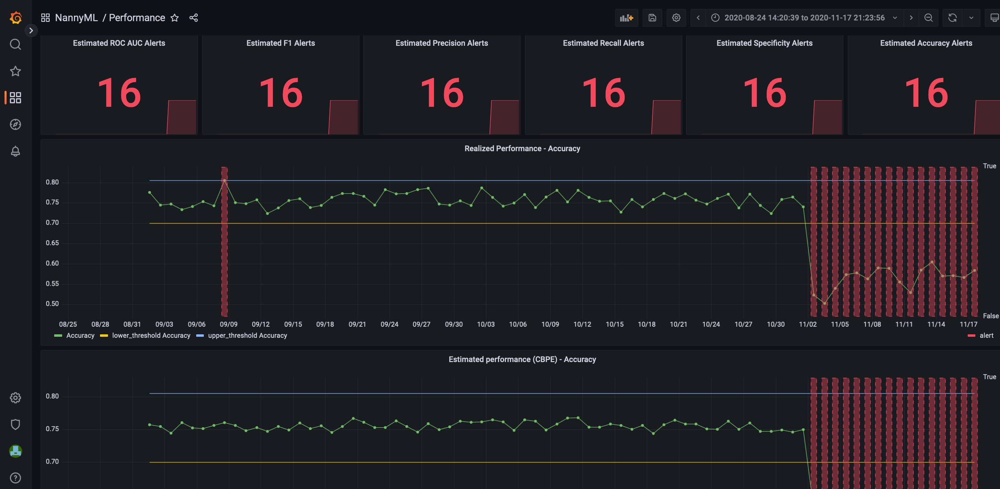

# Drift and performance dashboards for multiclass classification using NannyML, PostgreSQL and Grafana

The following example shows how to run NannyML from the command line to detect drift, estimate performance when targets
are missing and calculate realized performance when targets are available. 

The calculated results are then stored in a PostgreSQL database. Grafana has been configured to use this database as a
data source, allowing us to explore and visualize the results in an interactive and graphical way. We've included two
example dashboards to get started quickly.


## Requirements

All components of the example are running on your local system using containers. We're using `Docker` as a runtime and
`Docker compose` as an orchestrator.

Please ensure you have `Docker` (>= 20.10.17) and `Docker compose` (>= 2.10.2) available on your system.
You can follow the [official installation instructions](https://docs.docker.com/desktop/) for additional support.

## Walkthrough

### Reviewing the NannyML configuration

Let's quickly check out the NannyML configuration. It is located in the 
[`nann.yml` configuration file](nannyml/config/nann.yml).

The *reference*, *analysis* and available *target* datasets are defined first. They are to be read from the container filesystem under the 
`/data` directory. 

```yaml
input:
  reference_data:
    path: /data/mc_reference.csv

  analysis_data:
    path: /data/mc_analysis.csv

  target_data:
    path: /data/mc_analysis_gt.csv
    join_column: identifier
```

Check the [`docker-compose` file](docker-compose.yml) to see how the local data files
are mounted into the container.

We then define where to write our results to using the `output` section.
We are writing to a database here and provide a *connection string* to configure where and how to connect.
Remark that we also provide an optional `model_name`, to facilitate querying in the database
and ensure we can reuse the database to store other model results as well.

```yaml
output:
  database:
    connection_string: postgresql://nannyml:we<3nannyml@metrics-store:5432/nannyml
    model_name: credit_card_classification
```

We can instruct NannyML it is working on a multiclass classification model by providing the `problem_type` parameter. 
The optional `chunker` section allows us to configure chunking. Here we chunk by day, ensuring we have a single value
per day for each metric. There is a lot of data, so it might take a couple of minutes to process.

```yaml
problem_type: classification_multiclass

chunker:
  chunk_period: D
```

And finally we tell NannyML how to interpret your data, i.e. what columns represent features, predictions, targets etc.
We do this using the `column_mapping` section: 

```yaml
column_mapping:
  features:
    - acq_channel
    - app_behavioral_score
    - requested_credit_limit
    - app_channel
    - credit_bureau_score
    - stated_income
    - is_customer
  timestamp: timestamp
  y_pred: y_pred
  y_pred_proba:
    prepaid_card: y_pred_proba_prepaid_card
    highstreet_card: y_pred_proba_highstreet_card
    upmarket_card: y_pred_proba_upmarket_card
  y_true: y_true
```

### Starting the containers

We'll now spin up the three containers described in the [docker compose](docker-compose.yml) configuration:
1. `nannyml`: the NannyML container crunching the numbers
2. `metric-store`: a PostgresQL container providing the database where the results will be written into
3. `grafana`: a Grafana container preconfigured to connect to the `metric store` and visualize that data 
   in two included dashboards.

First ensure you're in the `binary_classification` directory, then use the following command to start them:

```shell
docker compose up
```

You'll see a lot of outputs flying by in the terminal, these are both PostgreSQL and Grafana booting.
After some time you'll start seeing the NannyML CLI output show up. You can see all of the calculators and estimators 
being run, before this container exits.

```
multiclass_classification-nannyml-1        | ──────────────────── Confidence Base Performance Estimator ─────────────────────
multiclass_classification-nannyml-1        |            fitting on reference data                               runner.py:466
multiclass_classification-nannyml-1        | [19:40:09] estimating on analysis data                             runner.py:477
multiclass_classification-nannyml-1        | [19:40:12] writing results                                         runner.py:502
multiclass_classification-nannyml-1        | ──────────────────────────── Direct Loss Estimator ─────────────────────────────
multiclass_classification-nannyml-1        |            DLE does not support 'CLASSIFICATION_MULTICLASS'        runner.py:522
multiclass_classification-nannyml-1        |            problems. Skipping DLE estimation.
multiclass_classification-nannyml-1        |
multiclass_classification-nannyml-1        |
multiclass_classification-nannyml-1        | Run complete ━━━━━━━━━━━━━━━━━━━━━━━━━━━━━━━━━━━━━━━━ 100% 0:00:00
multiclass_classification-nannyml-1 exited with code 0
```

At this point all data should be available in the database.

### Inspecting the database

We can use connect directly to the database container to get a look at the data inside.
Open up a new terminal and use the following command to spawn an interactive shell in the container:

```shell
docker compose exec -ti metrics-store /bin/bash
```

Now we can connect to the database. Note that we've seeded our database to create a custom database and a new user.
Feel free to check out the used [*DDL* script](db/ddl.sql) and the [docker compose](docker-compose.yml) file to see how. 

In the shell we've just opened, type the following to connect to the `nannyml` database as user `nannyml`:

```shell
psql nannyml nannyml
```

Inside the database console we can now check what tables are available using the `\dt+` command:

```
nannyml=> \dt+
                                                       List of relations
 Schema |                   Name                    | Type  |  Owner  | Persistence | Access method |    Size    | Description
--------+-------------------------------------------+-------+---------+-------------+---------------+------------+-------------
 public | cbpe_performance_metrics                  | table | nannyml | permanent   | heap          | 856 kB     |
 public | data_reconstruction_feature_drift_metrics | table | nannyml | permanent   | heap          | 192 kB     |
 public | dle_performance_metrics                   | table | nannyml | permanent   | heap          | 8192 bytes |
 public | model                                     | table | nannyml | permanent   | heap          | 16 kB      |
 public | realized_performance_metrics              | table | nannyml | permanent   | heap          | 856 kB     |
 public | run                                       | table | nannyml | permanent   | heap          | 8192 bytes |
 public | statistical_feature_drift_metrics         | table | nannyml | permanent   | heap          | 928 kB     |
 public | statistical_output_drift_metrics          | table | nannyml | permanent   | heap          | 272 kB     |
 public | target_drift_metrics                      | table | nannyml | permanent   | heap          | 176 kB     |
(9 rows)
```

We can perform simple queries to inspect some of the data, such as the CBPE performance metrics:

```
nannyml=> select * from cbpe_performance_metrics limit 10;
 id | model_id | run_id |   start_timestamp   |    end_timestamp    |      timestamp      | metric_name |       value        | alert |  upper_threshold   |  lower_threshold
----+----------+--------+---------------------+---------------------+---------------------+-------------+--------------------+-------+--------------------+--------------------
  1 |        1 |      1 | 2020-09-01 00:00:00 | 2020-09-02 00:00:00 | 2020-09-01 12:00:00 | ROC AUC     | 0.9073959544775457 | f     | 0.9365857731425166 | 0.8777709600695177
  2 |        1 |      1 | 2020-09-02 00:00:00 | 2020-09-03 00:00:00 | 2020-09-02 12:00:00 | ROC AUC     |  0.908407000011692 | f     | 0.9365857731425166 | 0.8777709600695177
  3 |        1 |      1 | 2020-09-03 00:00:00 | 2020-09-04 00:00:00 | 2020-09-03 12:00:00 | ROC AUC     |   0.90308165256763 | f     | 0.9365857731425166 | 0.8777709600695177
  4 |        1 |      1 | 2020-09-04 00:00:00 | 2020-09-05 00:00:00 | 2020-09-04 12:00:00 | ROC AUC     | 0.9106309997187778 | f     | 0.9365857731425166 | 0.8777709600695177
  5 |        1 |      1 | 2020-09-05 00:00:00 | 2020-09-06 00:00:00 | 2020-09-05 12:00:00 | ROC AUC     | 0.9073435809765212 | f     | 0.9365857731425166 | 0.8777709600695177
  6 |        1 |      1 | 2020-09-06 00:00:00 | 2020-09-07 00:00:00 | 2020-09-06 12:00:00 | ROC AUC     | 0.9038182366673905 | f     | 0.9365857731425166 | 0.8777709600695177
  7 |        1 |      1 | 2020-09-07 00:00:00 | 2020-09-08 00:00:00 | 2020-09-07 12:00:00 | ROC AUC     | 0.9069336463072224 | f     | 0.9365857731425166 | 0.8777709600695177
  8 |        1 |      1 | 2020-09-08 00:00:00 | 2020-09-09 00:00:00 | 2020-09-08 12:00:00 | ROC AUC     | 0.9099156087284016 | f     | 0.9365857731425166 | 0.8777709600695177
  9 |        1 |      1 | 2020-09-09 00:00:00 | 2020-09-10 00:00:00 | 2020-09-09 12:00:00 | ROC AUC     | 0.9077343327900863 | f     | 0.9365857731425166 | 0.8777709600695177
 10 |        1 |      1 | 2020-09-10 00:00:00 | 2020-09-11 00:00:00 | 2020-09-10 12:00:00 | ROC AUC     | 0.9033029916394829 | f     | 0.9365857731425166 | 0.8777709600695177
(10 rows)
```

Or we can count the number of alerts per day for each metric:

```
nannyml=> select count(*), metric_name from cbpe_performance_metrics where alert group by metric_name;
 count | metric_name
-------+-------------
    61 | Precision
    61 | Specificity
    61 | Recall
    61 | ROC AUC
    61 | Accuracy
    61 | F1
(6 rows)
```

You can now exit the database console by typeing `\q` followed by `exit` to exit the database container shell.


### Viewing the dashboards

Now that we know what we can play with we can connect to our local Grafana instance. 

Open up a web browser and visit [http://localhost:3000](http://localhost:3000) to open up Grafana. You can log in with 
username `nannyml` and password `nannyml`.

<p></p>

In the menu on the left hand side, hover over the `dashboards` menu, then click `browse` to get an overview of 
the available dashboards. The example dashboards are located in the `NannyML` directory.

<p></p>

You can now view both the *Drift* and *Performance* example dashboards. 

<p></p>

<p></p>

Be sure to review the configuration behind the dashboard panels and variables to see how they are populated. 

### Stopping the demo

You can stop the spun up containers by forming `CTRL+C`. To fully remove the containers you can follow up with the 
`docker compose down` command.

## Final remarks

- Grafana also allows you to configure alert rules and notifications, check out the 
[official documentation](https://grafana.com/docs/grafana/latest/alerting/alerting-rules/) on how to set that up.
